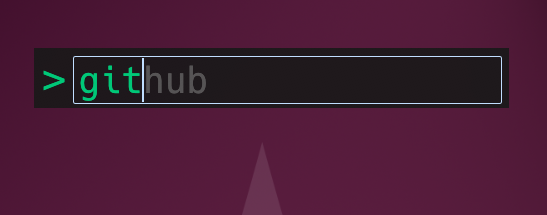

# SlickRun for Ubuntu

A fast command launcher for Linux (GNOME/Wayland), inspired by [SlickRun for Windows](https://bayden.com/slickrun/).



Type a keyword, hit Enter, and it runs. That's it.

  

## Quick Start

1. Install runtime dependencies:

```bash
sudo apt install -y libgtk-3-0 libayatana-appindicator3-1
```

2. Download `slickrun` from the [latest release](https://github.com/Zerg00s/slickrun-ubuntu/releases/latest)

3. Make it executable and run:

```bash
chmod +x slickrun
./slickrun
```

4. **First run only**: log out and back in for the global hotkey to work (GNOME Shell extension needs a one-time reload)

5. Press **Win+Shift+Q** to show/hide the launcher

### Optional: Install system-wide

```bash
sudo cp slickrun /usr/local/bin/
```

## Features

- **Magic Words** -- define keyword shortcuts for commands, URLs, and scripts
- **Autocomplete** -- type-ahead hints with Tab completion
- **Global hotkey** -- summon the launcher from anywhere (default: Win+Shift+Q)
- **System tray** -- Show/Hide, Settings, and Quit from the tray icon
- **Auto-hide** -- hides when it loses focus
- **Always on top** -- stays above other windows
- **Draggable** -- click and drag anywhere outside the text input
- **Remembers position** -- persists window location between sessions
- **Configurable** -- font color, size, opacity, window dimensions, hotkey
- **Start at login** -- optional autostart via XDG autostart
- **Import/Export** -- backup and restore your magic words as JSON
- **`$W$` substitution** -- pass arguments to magic words (e.g., `g rust traits` -> Google search)
- **`@copy@`** -- special command that copies resolved parameters to clipboard

## Built-in Commands

| Command | Action |
|---------|--------|
| `setup` | Opens the settings window |
| `quit`  | Exits the application |

Any unrecognized input is executed as a shell command (`sh -c "..."`).

## Configuration

Settings are stored at `~/.config/slickrun/config.json`.

Open settings by typing `setup` in the launcher, or via tray icon > Settings.

### Settings Tabs

- **Library** -- add, edit, delete, search, import/export magic words
- **Appearance** -- font color, font size, window width/height
- **Options** -- hotkey, start at login, auto-hide, stay on top, opacity

## Building from Source

### Prerequisites

```bash
# Ubuntu/Debian
sudo apt install -y libgtk-3-dev libayatana-appindicator3-dev

# Fedora
sudo dnf install gtk3-devel libayatana-appindicator-gtk3-devel
```

### Build

```bash
cargo build --release
strip target/release/slickrun
```

The binary will be at `target/release/slickrun`.

## License

MIT
